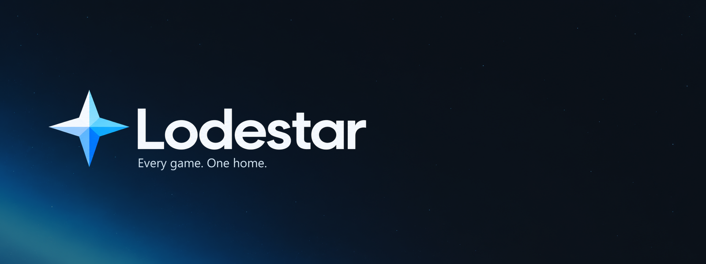
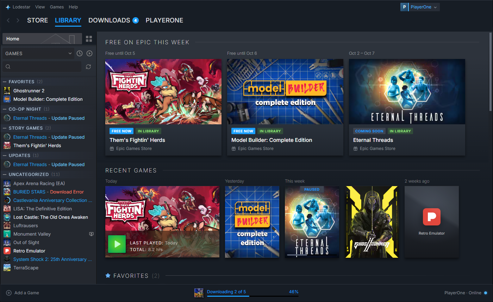
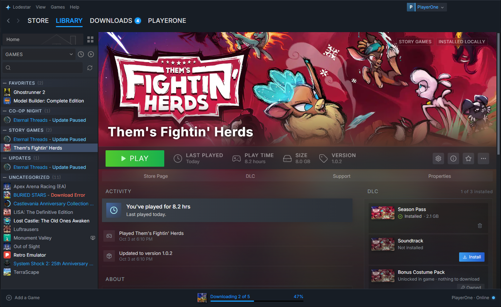
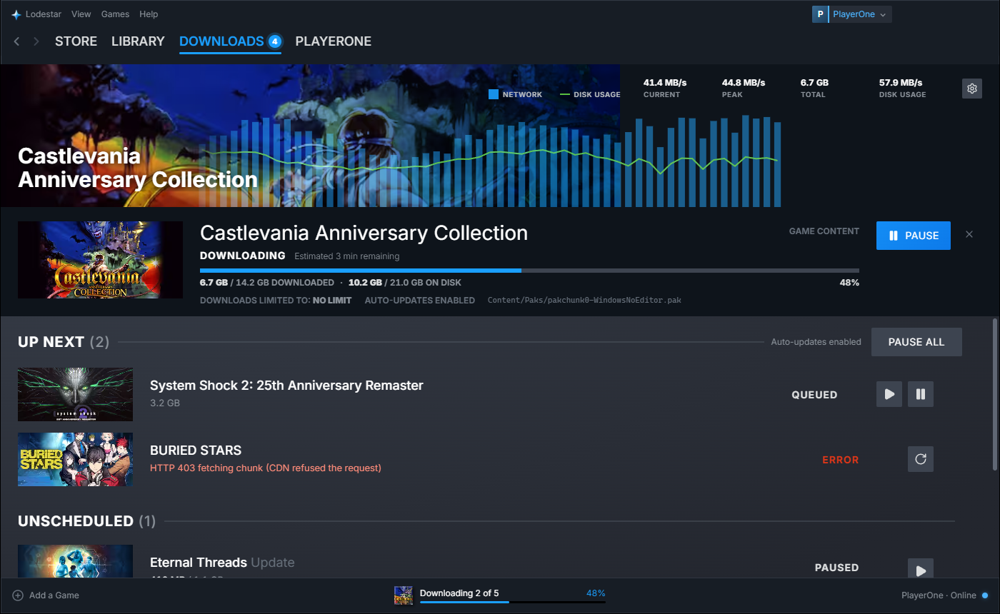
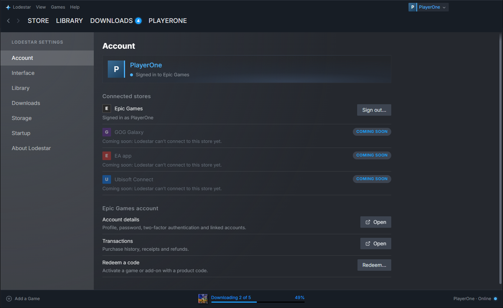

<p align="center">
  
</p>

<p align="center">
  <b>A fast, beautiful, Steam-style launcher for your Epic Games library.</b><br>
  Your games, without the bad launcher. More stores are coming.
</p>

<p align="center">
  
  
  
  
</p>

## Why

The official Epic Games launcher is slow and awkward. Lodestar gives your Epic library the client it deserves: a library, downloads manager and store that feel like Steam. It installs, updates and launches your games itself, so the Epic launcher isn't needed.

## Features

- **Steam-style library.**
  - **Sidebar:** Favorites, collections, Running and Updates sections, type-ahead search and full keyboard control.
  - **Home:** "Free on Epic this week", recent games, and a cover-art grid with size and sort options.
  - **Game pages:** hero art, a big PLAY button, play time, DLC, and Manage links.
  - **Menus and dialogs:** right-click menus and a Properties dialog (launch options, updates, installed files, DLC, custom artwork).
- **Its own downloader.** Downloads straight from Epic's CDN in parallel, checking every file as it's written. Pause and resume, even across restarts.
  - **Smart updates:** reuses the data already on disk and only downloads what changed. A Rocket League patch dropped from 28.8 GB to 4.7 GB.
  - **Repair:** verifies an install and re-downloads only damaged files.
- **Steam-style downloads page:** network and disk graphs, a reorderable queue, a bandwidth limit, optional auto-updates, and downloads that pause while you play.
- **Real play tracking.** "Running" and play time follow the game's actual processes, not just its launcher stub, so Stop really stops the game.
- **Keeps your installs.** Adopts games the Epic launcher installed, including folders the launcher lost track of, with their DLC and optional content packs. You can also point it at an existing folder, or move an install to another drive.
- **Add non-Epic games.** Add any program on your PC, like Steam's "Add a Non-Steam Game".
- **Desktop shortcuts** that launch games through Lodestar (`lodestar://`).
- **Epic's store, built in,** with one sign-in shared with the app. Lodestar never sees your password: you sign in on Epic's own page.
- **Storage manager, system tray, close-to-tray and launch at login.**

## Getting started

```bash
npm install
npm run dev          # the full app, with hot reload
npm run dev:web      # UI only, in a browser at http://localhost:5174, with mock data
npm run typecheck
```

`dev:web` runs against a built-in mock backend, so you can work on the UI without an Epic account. Append `?mock=signedout`, `?mock=loading`, `?mock=many` (600 games) or `?mock=empty` to the URL to see those states.

## Building

| Command | Output |
| --- | --- |
| `npm run dist:win` | `dist/Lodestar-Setup-x.y.z.exe` (NSIS installer) |
| `npm run dist:store` | `dist/Lodestar-x.y.z.appx` for the Microsoft Store |
| `npm run dist:mac` | `dist/Lodestar-x.y.z-mac.dmg` (universal). You must build this on a Mac. |

To regenerate the icons from `branding/`, run `npx electron scripts/make-icons.cjs`.

**Microsoft Store:**
1. Reserve the name in Partner Center.
2. Copy **Product identity** into the `appx` section of `electron-builder.yml`.
3. Run `npm run dist:store` and upload the package.

**macOS:** ship a signed and notarized DMG; set `CSC_LINK`, `APPLE_ID`, `APPLE_APP_SPECIFIC_PASSWORD` and `APPLE_TEAM_ID`. The Mac App Store's sandbox doesn't allow game launchers.

## Architecture

```
src/
  shared/      types + the IPC contract (api.ts is the whole surface)
  main/        Electron main process
    core/      library, downloads queue, settings, tray, process tracking, logging
    providers/ one folder per store; implement GameProvider to add GOG, EA, Ubisoft...
      epic/    OAuth, library and catalog, manifest parser, installer, launcher-data import
      local/   non-Epic games
  preload/     exposes window.lodestar
  renderer/    React 19 UI (zustand store; Steam-style views)
docs/          Steam UI reference, QA audit, screenshots
branding/      logo, icon, banner
```

### How the Epic integration works
- **Sign-in:** happens in a window showing Epic's real login page. Lodestar exchanges the resulting code for tokens, which are encrypted with the OS keychain and refreshed automatically.
- **Library:** comes from Epic's library, catalog and assets services, so update detection is automatic.
- **Installs:** Lodestar parses Epic's build manifests (binary and legacy JSON), downloads the chunks in parallel, writes the files, and checks each one's SHA-1. A resume log makes pausing and crashes safe. Updates reuse chunks already on disk; changed files are staged and swapped in at the end.
- **Launching:** Lodestar runs the game directly with Epic's auth arguments, plus an ownership token for games that need one. Games managed by EA or Ubisoft go through the official launcher.

## Status

Early but very usable. Not done yet: cloud saves, achievements, friends, and choosing optional content packs on first install. Logs are in `%APPDATA%\Lodestar\logs\lodestar.log`.

Lodestar uses the same public launcher client credentials as the open-source projects [Legendary](https://github.com/derrod/legendary) and [Heroic](https://github.com/Heroic-Games-Launcher/HeroicGamesLauncher). It is not affiliated with Epic Games, Inc. or Valve Corporation. "Epic Games" and "Steam" are trademarks of their owners.

## License

[MIT](LICENSE)
